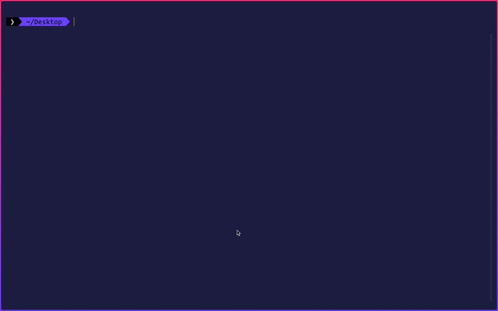

<div align="center">
	
	
	
	<a href="https://stars.github.com/nominate/">
		
	</a>
</div>
<br>

<p align="center">
	<strong>Instantly set up Next.js blog with TypeScript or JavaScript</strong>
</p>


- **JavaScript Blog**: Set up a blog with JavaScript in seconds
- **TypeScript Blog**: Set up a blog with TypeScript in seconds
- **Tailwind CSS**: Supports Tailwind CSS out of the box for TypeScript ATM
- **Unopinionated**: No opinionated styling or UI. You can build your own UI on top of it
- **Category**: Create different post category with category individual pages. Read more [here](#create-categories)
- **Post**: Create a new blog post by creating a new markdown file in the `posts` directory
- **Route**: Automatically create routes for your blog posts based on the markdown file name
- **SEO**: Use your blog post frontmatter to add SEO tags to your blog post
- **Markdown components**: Use React components in your markdown blog posts
- **MIT License**: Free to use for personal and commercial projects

<br>

[*Live demo of the blog*](https://create-nextjs-blog.vercel.app/blog)

<br>


## Installation

```sh
# use it with npx (recommended)
npx create-nextjs-blog@latest

# install the CLI globally
npm i -g create-nextjs-blog@latest
```

<br>


## Usage

```sh
# npx: create a new Next.js blog
npx create-nextjs-blog@latest

# npx create a next Next.js blog with TypeScript
npx create-nextjs-blog@latest --typescript

# npx create a next Next.js blog with Tailwind CSS & TypeScript
npx create-nextjs-blog@latest --withTailwind

# npx create a next Next.js blog with JavaScript
npx create-nextjs-blog@latest --javascript

# global: create a new Next.js blog
cnb

# global: create a next Next.js blog with TypeScript
cnb --typescript

# global: create a next Next.js blog with Tailwind CSS & TypeScript
cnb --withTailwind

# global: create a next Next.js blog with JavaScript
cnb --javascript
```

>Once the blog is set up, run the Next.js app and navigate to [`http://localhost:3000/blog`](http://localhost:3000/blog) to see your blog. I highly recommend using [Vercel](https://vercel.com) to deploy your blog.

## Demo



<br>


## Create a new blog post

1. Create a new markdown file in the `posts` directory. For example, if you want to create a new blog post named `my-first-blog-post`, create a new file named `my-first-blog-post.md`.
2. Add the frontmatter to the markdown file. The frontmatter is the metadata of your blog post. It contains the title, description, tags (SEO keywords), category, publish date, modified date, cover image of your blog post. Here is an example of the frontmatter.

```mdx
---
title: Hello World
description: 'Lorem ipsum dolor sit amet, consectetur adipiscing elit, sed do eiusmod tempor'
tag:
    - example
    - demo
category:
    - test
publishedDate: 2022-12-28T16:27:05.876Z
lastModifiedDate: 2022-12-28T16:27:05.876Z
cover: ''
---
```

3. Add the content of your blog post to the markdown file. You can use React components in your markdown file. Click [here](#inject-markdown-components) if you want to learn how to inject React components in your blog. The following is an example of a markdown blog post that uses a React component.

```md
## Paragraph

Lorem ipsum dolor sit amet, *consectetur* adipiscing elit, sed do eiusmod tempor **incididunt** ut labore et dolore magna aliqua. Ut enim ad minim veniam, quis nostrud exercitation ullamco laboris nisi ut aliquip ex ea ***commodo*** consequat.

<Note>
    This is a sample note
</Note>
```

4. If you want to locally look at the blog post in your browser, run the following command once in your terminal.

```sh
npm run generate-data
```

5. Now navigate to [`http://localhost:3000/blog/my-first-blog-post`](http://localhost:3000/blog/my-first-blog-post) to see your blog post.
6. Once you are done, push the markdown file to your GitHub repository. Your blog post will be automatically deployed to your blog site.

>You only need to run the command in step #4 once. You don't have to run it again after updating the file.

## Create categories

***Add a new category***

To add a new category, go to the `data/categories.json` file and create an object with your category. For example, if you want to add a `life` category, add an object with a single `name` key inside they JSON array.

```json
[
	{
		"name": "life"
	}
]
```

***Use category in your blog file***

To use this newly created `life` category in your blog file, just add it as a value to the category in your markdown file frontmatter. For example, if you want to add a `life` category to your blog post, here is how you can do it.

```mdx
---
title: 'My first blog post'
description: 'This is my first blog post'
category:
    - life
---
```

***Category page***

- Your blog site has a category page. To access this page, navigate to [`http://localhost:3000/blog/category`](http://localhost:3000/blog/category) to see all the different blog categories you have.
- To access a specific category page, navigate to [`http://localhost:3000/blog/category/guide`](http://localhost:3000/blog/category/guide) to see all the blog posts with the `guide` category.
- You can also click on the category name in the blog post card at [`http://localhost:3000/blog`](http://localhost:3000/blog) to navigate to the category page.
- Here is the live [demo](https://create-nextjs-blog.vercel.app/blog/category) of the category page. Click on any category, all the posts in that category will be displayed. If you want to see all the posts, navigate to [`https://create-nextjs-blog.vercel.app/blog`](https://create-nextjs-blog.vercel.app/blog).

## Inject Markdown Components

***Create a component***

The CLI uses [next-mdx-remote](https://github.com/hashicorp/next-mdx-remote) to render markdown files. You can create your own components and use them in your markdown files. To create a component, create a new file in the `components/markdown` directory. For example, if you want to create a `Note` component, create a new file in the `components/markdown` directory named `Note.js` or `Note.tsx` depending on the type of blog you created.

```js
const Note = ({ children }) => {
	return (
		<p
			style={{
				backgroundColor: '#fad',
				borderRadius: '10px',
				boxShadow: '0 0 5px #fad',
				padding: '10px',
				margin: '0 20px'
			}}
		>
			<em>{children}</em>
		</p>
	);
};

export default Note;
```

***Add the component in the `components/markdown/index.js` or `index.tsx` file***

```js
import dynamic from 'next/dynamic';

const Note = dynamic(() => import('./Note'), { ssr: false });

const MarkdownComponents = () => {
	return {
		// h1: (props: any) => <h1 {...props} />,
		Note: props => <Note {...props} />
	};
};

export default MarkdownComponents;
```

***Use this component in your markdown blog files***

```md
<Note>You can use this component in your markdown files.</Note>
```

***Live demo***

You can see a live demo of this component [here](https://create-nextjs-blog.vercel.app/blog/hello-world). You can find its source code [here](https://github.com/msaaddev/create-nextjs-blog/tree/main/examples/markdown-blog-javascript/components/markdown).

## Contributing Guidelines

Make sure you read the [contributing guidelines](https://github.com/msaaddev/create-nextjs-blog/blob/main/contributing.md) before opening a PR.

## Other Projects

I have curated a [detailed list](https://github.com/msaaddev/open-source) of all the open-source projects I have authored. Do take out a moment and take a look.

## License & Conduct

-   MIT © [Saad Irfan](https://github.com/msaaddev)
-   [Code of Conduct](https://github.com/msaaddev/create-nextjs-blog/blob/main/code-of-conduct.md)
